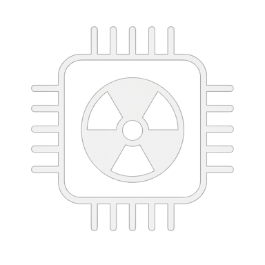
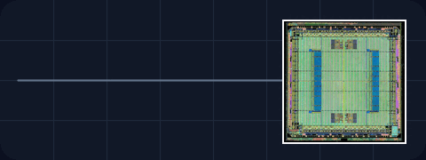

<h1 align="center">Reza Aliasgari Renani</h1>

  
  &nbsp;&nbsp;&nbsp;&nbsp;
  
  &nbsp;&nbsp;&nbsp;&nbsp;
  

  Email: <a href="mailto:aliasgari.rrkh@phystech.edu">aliasgari.rrkh@phystech.edu</a> |
  Gmail: <a href="mailto:rezaaliasgarirenani@gmail.com">rezaaliasgarirenani@gmail.com</a> |
  Phone: <a href="tel:+79850692342">+7 (985) 069-23-42</a>

---

  <strong>RTL Design | Semiconductor Physics | Plasma Systems</strong>

  I work on manual and generated Verilog/SystemVerilog HDL implementations of fixed-point DSP and FPGA-based image signal processing pipelines, experimental techniques for electrical characterization of irradiated semiconductor devices with MATLAB automation programs and electron-beam plasma systems for simulating space-flight radiation conditions.

  
  &nbsp;
  
  &nbsp;
  
  &nbsp;
  
  &nbsp;
  
  &nbsp;
  
  &nbsp;
  
  &nbsp;
  

## Education

### [Moscow Institute of Physics and Technology (MIPT, Phystech)](https://mipt.ru/)

Sep 2024 -- Jun 2026  
**M.S.** in Applied Mathematics and Physics, Plasma Systems, **GPA: 4.82/5.0**  
Moscow, Russia

- **Thesis title:** Investigation of radiation-induced effects on programmable microelectronic systems by means of plasma-based facilities simulating space flight conditions.

### [Moscow Institute of Physics and Technology (MIPT, Phystech)](https://mipt.ru/)

Sep 2020 -- Jun 2024  
**B.S.** in Technical Physics, Aerospace Engineering, **GPA: 4.56/5.0**  
Moscow, Russia

- **Thesis title:** Investigation of the effect of low energy (1 - 20 keV) electron and high energy (1 MeV) gamma quanta irradiation on the electro-physical properties of dielectric-semiconductor structures.

## Research Experience

### [Laboratory of Software and System-on-Chip Development](http://ai.mipt.ru/design-center)

[**Design Center for the Development of Microprocessor Technology, MIPT**](http://ai.mipt.ru/design-center)  
**Programmer / RTL Design Engineer**  
Sep 2024 -- Present  
Moscow, Russia

- **Verilog RTL Development:** Ported mathematical algorithms into Verilog. Built a fixed-point arithmetic library and LUT-based function approximations using Horner's method. Implemented image signal processing algorithms using both Simulink-generated and manually written HDL code. Optimized latency and throughput by resolving synchronization and pipelining issues. **ISP** algorithms: rgb2hsv, Sobel operators, tone mapping, demosaicing, lens distortion correction, and resizing.
- **Simulation, Verification, and Synthesis:** Built custom SystemVerilog testbenches for AXI and AXI4-Stream interfaces that streamed image data with video-control timing, captured output pixels, and compared reconstructed frames with Python, MATLAB, and Simulink reference models. Automated image conversion, memory-file generation, simulation, and output analysis using Python and cocotb. Ran RTL simulations with Synopsys VCS, Cadence simulators, Vivado Simulator, and Icarus Verilog. Synthesized, mapped, routed, and generated bitstreams using Vivado. Verified ISP pipelines on Xilinx Zybo Z7-20 and Nexys Video boards using HDMI test-image streams and a live Pcam 5C camera.
- **FPGA Devices under Electron-Beam Plasma Exposure:** Conducted irradiation experiments on FPGA boards using electron beams (25 -- 60 keV, up to 100 mA) in low-pressure oxygen atmospheres (10−6 -- 50 Torr), generating plasma and X-rays. Applied combined thermal cycling (218--393 K) and surface charging to evaluate FPGA reliability under plasma conditions.

### [Laboratory of Local Diagnostics of Semiconductor Materials](https://www.iptm.ru/index.en.html)

[**Institute of Microelectronics Technology, Russian Academy of Sciences (IMT RAS)**](https://www.iptm.ru/index.en.html)  
**Laboratory Researcher**  
Mar 2023 -- Aug 2024  
Moscow, Russia

- **Experimental Equipment Installation and Automation:** Installed experimental devices including Everbeing Cryo-station (80--450 K) with 4 micromanipulators, Lakeshore Temperature Controller Model 336, Keithley SourceMeter 2450, Parametric Analyzer Keithley 4200A-SCS, Keysight Electrometer B2987A, Aktakom 3048, and Zurich Instruments MFIA Impedance Analyzer. Developed [applications](https://github.com/rezaaliasgarirenani/imt_ras) in MATLAB to automate experimental techniques: thermally stimulated current, capacitance-voltage, current-voltage, current-time, and deep-level transient spectroscopy.
- **Electrical Characterization of Irradiated MOS Devices:** Selected appropriate C--V and TSC measurement parameters based on semiconductor physics. Characterized SiO2-based, aluminum-gated MOS capacitors after 1--20 keV electron and 1 MeV gamma irradiation using capacitance--voltage and thermally stimulated current measurements over 80--400 K.
- **Experimental Investigation:** Combined C--V shifts with TSC spectra to locate electrically active traps within the dielectric or semiconductor or at their interface, classify electron- or hole-trapping behavior, and estimate activation energies. Analyzed the heating-rate dependence of TSC peak positions and magnitudes, calculated interface-state density and related MOS parameters, and processed the results in MATLAB and Origin Pro for comparison with theoretical models.

## Publications

### Journals

[1] <u>R. Aliasgari Renani</u>, O. A. Soltanovich, M. A. Knyazev, and S. V. Koveshnikov, "Investigation of low energy electron irradiated SiO2 based MOS devices by capacitance-voltage and thermally stimulated current techniques," *Russian Microelectronics*, vol. 52, no. S1, pp. S274--S278, Dec. 2023, Journal Paper, [DOI](https://doi.org/10.1134/S1063739723600516).

### Conferences

[1] <u>R. Aliasgari Renani</u> et al., "Investigation of FPGA resource utilization in manual and Simulink-generated Verilog implementations of image signal processing algorithms," in Proc. *[28th International Conference on Digital Signal Processing and its Applications](https://ieeexplore.ieee.org/xpl/conhome/11475814/proceeding)* (*[DSPA](http://dspa-conf.org/pages/home)*), 2026, [Conference Paper](http://dspa-conf.org/storage/Programmee/DSPA_2026_Programme_FULL_ONLINE.pdf), [DOI](https://doi.org/10.1109/DSPA69176.2026.11476776).

[2] <u>R. Aliasgari Renani</u> and M. N. Vasiliev, "Simulating space environments with electron-beam plasma for FPGA radiation testing," in Proc. *[68th All-Russian Scientific Conference of MIPT](https://conf.mipt.ru/)*, 2026, [Presentation](https://conf.mipt.ru/conference/23999).

[3] <u>V. Vologin</u>, R. Aliasgari Renani, V. Vasilevskiy, and V. Chesnokov, "Comparative analysis of manual and Simulink-generated Verilog code for image processing algorithms," in Proc. *[YADRO FPGA-Systems Conference](https://meetups.yadro.com/fpga-msk-1125/)*, 2025, [Presentation](https://youtu.be/gtiT_CfQKJo?t=17068).

[4] <u>R. Aliasgari Renani</u>, O. A. Soltanovich, M. A. Knyazev, and S. V. Koveshnikov, "Study of SiO2 based MOS by capacitance-voltage and thermally stimulated current techniques," in Proc. *[15th Int. Conf. Micro- and Nanoelectronics](https://inspirehep.net/conferences/2773156)* (*[ICMNE](https://icmne.ftian.ru/glavnaja/)*), 2023, p. 122, [Presentation](https://icmne.ftian.ru/wp-content/uploads/icmne-2023_e-version.pdf).

[5] <u>R. Aliasgari Renani</u>, O. A. Soltanovich, M. A. Knyazev, and S. V. Koveshnikov, "Investigation of electrically active defects introduced into silicon oxide by irradiation of low-energy electrons," in Proc. *[2nd Joint Conf. Electron Beam Technol. and X-ray Optics in Microelectronics](https://cebt23.iptm.ru/)* (*[CEBT](https://cebt23.iptm.ru/)*), 2023, [Poster](https://cebt23.iptm.ru/download/numbered/91.pdf).

## Skills

| Advanced | Intermediate |
| --- | --- |
| Automation of Experimental Techniques | Python, C++, Arduino |
| Electrical Characterization | Vivado, Vitis, Vitis HLS |
| MATLAB, Simulink, HDL Coder | OriginLab, Data Processing |
| Verilog, RTL, FPGA Development | SolidWorks, 3D Design |
| SciPy, cocotb, OpenCV | PCB, EasyEDA |
| Git, Linux OS, LaTeX, Microsoft Office | OpenRocket, ERDAS IMAGINE |
| English (C2), Persian (Native) | German (B1), Russian (B1) |

## Projects

### [REST API using Python and FastAPI](https://github.com/rezaaliasgarirenani/fastapi_phystech_fpga)

**Jan 2026 -- Jun 2026**

- Developed and tested a REST service with SQLite, SQLAlchemy, JWT authentication, CRUD endpoints, and a rule-based FPGA selection algorithm for space missions.

### [Engineering Prototypes and Models](https://github.com/rezaaliasgarirenani/engineering_projects)

**Jun 2022 -- Apr 2025**

- [Rocket:](https://github.com/icarus-imperium/) Built and launched several model rockets (30 N·s impulse) for MIPT Cosmonautics Day events.
- [Lunar Rover:](https://github.com/rezaaliasgarirenani/engineering_projects/tree/main/rover) Developed a rover prototype capable of obstacle navigation without round wheels.
- [Detection System:](https://github.com/rezaaliasgarirenani/engineering_projects/tree/main/aircraft_detection_system) Built a photoresistor-based tracking system with rotational and translational motion.

### [CubeSat Orbital Deployer](https://github.com/rezaaliasgarirenani/cubesat_deployer)

**Mar 2023 -- Aug 2024**

- Designed SolidWorks 3D models for an orbital deployer and a vibration fixture. Prototypes passed random vibration simulation and mechanical testing on a vibration test stand in the [Mechanical Systems Laboratory](https://mipt.ru/science/labs/laboratoriya-modelirovaniya-mekhanicheskikh-sistem-i-protsessov).

### [Non-Conservative Electric Fields and Voltmeters](https://github.com/rezaaliasgarirenani/phystech_academics/tree/main/non-conservative-electric-fields-and-voltmeters)

**May 2022**

- Designed an experimental setup to analyze the position dependence of voltmeter readings in parallel circuits.

## Awards & Scholarships

- MIPT Professional Python Programming Diploma, Jul 2026
- Participant in the [5th and 7th Eurasian Aerospace Congresses](https://congress.aero/en/), Jul 2023 and Jul 2025
- M.S. Admission Offers with Scholarships: MIPT & Skoltech, Apr 2024
- MIPT Travel Grant: 15th ICMNE Conference, Oct 2023
